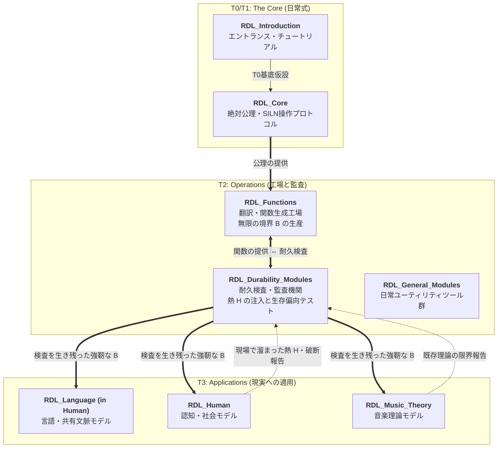

# Aporapeiron

**関係力学言語（RDL: Relational Dynamics Language）** の規格、実装モジュール、および社会・人間・科学への応用パラダイムを管理するオーガニゼーションです。

> **関係力学言語とは、関係を切り取り、記述し、再構築するための共通言語である。**
> 
> 絶対的な真理を一つに定めるための宗教ではない。
> 全てを一つの数式で閉じるための理論でもない。
> 予測が外れること、熱が溜まること、壊れることを前提に置き、それでも生存のために再構築を続けるための言語である。

---

## 🧬 RDL Ecosystem Architecture

Aporapeiron の全リポジトリは、独立したファイル置き場ではありません。
これらは全体で一つの生命体のように、**「基礎公理（日常式） $\to$ レンズの生産 $\to$ 耐久検査 $\to$ 現実への適用」** という代謝プロセス（SILN）を回すように設計されています。

---

## 📂 リポジトリ群の役割

### 1. [RDL_Introduction](https://github.com/Aporapeiron/RDL_Introduction) (T0 / Entrance)
🔰 初めての方はこちらへ。RDLの難解な定義や数式を一旦脇に置き、マニフェスト（宣言）と「日常の比喩」を通して世界観を感覚的に掴むためのエントランスです。

### 2. [RDL_Core](https://github.com/Aporapeiron/RDL_Core) (T0 / T1)
RDLの「公理の聖域」。世界そのものではなく、解釈のズレを計算するための絶対公理（HYP / SPEC）と、対象を展開・選択・再構築する能動的プロトコル（SILN）を保持します。私たちが生きる「日常の当たり前」を数式化したものです。

### 3. [RDL_Functions](https://github.com/Aporapeiron/RDL_Functions) (T2 工場)
T0/T1 の日常式を、ニューラルネットワーク、微分方程式、力学シミュレーションなど、具体的な数学・AIアルゴリズムに「翻訳」する変換エンジン。世界を切り取るためのレンズ（境界 $B$）を無限に作り出す工場です。

### 4. [RDL_Durability_Modules](https://github.com/Aporapeiron/RDL_Durability_Modules) (T2 監査機関)
`RDL_Functions` で作られた関数や既存の理論に対し、わざと過酷なノイズや熱（$H$）を注入して極限状態に追い込む耐久検査機関。机上の空論を破棄し、実用に耐えうる強靭な構造だけを残す（Survival-biased）役割を担います。

### 5. [RDL_General_Modules](https://github.com/Aporapeiron/RDL_General_Modules) (T2 ユーティリティ)
分析を手助けする補助ツール、よく使うテンプレ、チェックリストなどをカジュアルに配置するユーティリティボックスです。

### 6. [RDL_Human](https://github.com/Aporapeiron/RDL_Human) (T3 適用層)
耐久検査を生き残った強靭な $B$ を用いて、人間の認知、社会システム、そして「言語や共有文脈・空気」などの複雑な対象を多眼的に記述・操作する応用プロジェクトです。

### 7. [RDL_Music_Theory](https://github.com/Aporapeiron/RDL_Music_Theory) (T3 適用層)
音楽を単なる「音符の並び」ではなく、「熱（$H$）の蓄積とカタルシス的解放」の力学として再定義する応用プロジェクトです。

---

## 🌌 Why "Aporapeiron" ?

Aporia（行き詰まり・破断） ＋ Apeiron（無限）。
どんな理論やルール（境界 $B$）も、必ずこぼれ落ちる余剰（$\xi$）によっていつか限界（Aporia）を迎えます。
しかし私たちはそれを絶望とは呼ばず、構造が壊れる極限の場所からこそ新しい無限（Apeiron）が立ち上がると定義します。
答えのない世界を、自らの偏りを頼りに、自己モデルを更新し続けながら生きる。そのための言語的エコシステムが、Aporapeiron です。
