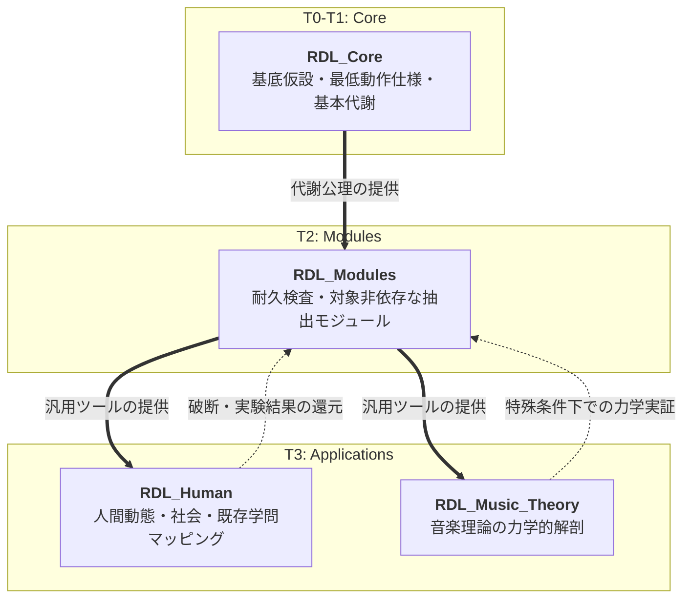

# Aporapeiron

**関係力学言語（RDL: Relational Dynamics Language）** の基底、検証モジュール、および社会・人間・諸芸術への応用生態系を管理するオーガニゼーションです。

> **関係力学言語とは、関係を見て、記述して、操作するための言葉である。**
> 
> それは、世界を一つに決めつけるための主義ではない。
> また、世界を一つの説明原理で閉じるための理論でもない。
> 決めつけられない世界を、それでも丁寧に見て、言葉にし、必要なら扱い直すための言葉である。

---

## 🪐 RDL Ecosystem Architecture

RDL のリポジトリ群は、自己代謝するひとつのシステムとして、**基底層（T0/T1）**から**応用層（T3）**へと階層化・分割されています。

---

## 📂 Repositories

### 1. [RDL_Core](https://github.com/Aporapeiron/RDL_Core) (T0/T1)
RDLのすべての土台。基底仮設（B, ξ）、基本代謝プロセス（SILN）、共通語彙を保持するコア。
★ はじめての方は、ここにある [**関係力学言語とは如何なるものか（宣言）**](https://github.com/Aporapeiron/RDL_Core/blob/main/00_関係力学言語とは如何なるものか_宣言.md) からお読みください。

### 2. [RDL_Modules](https://github.com/Aporapeiron/RDL_Modules) (T2)
対象に依存しない汎用的な力学構造（相転移、重力場、拘束度計算など）と、RDL自体の「耐久検査（破断アタック）」の手法を隔離・抽出したモジュール群。

### 3. [RDL_Human](https://github.com/Aporapeiron/RDL_Human) (T3)
人間という特定の対象における「固有仮説」の実験場。4層時間スケール、SFO流向、笑いと快の放熱力学、道具結合のほか、心理学や経済学など**人類の「既知学問」をRDLの力学軸へ翻訳・マッピングしたツリー**を展開。

### 4. [RDL_Music_Theory](https://github.com/Aporapeiron/RDL_Music_Theory) (T3)
音楽を「純粋な関係構造の推移」と「熱（H）の蓄積とカタルシス的放熱」の力学として再解剖する応用群。音の引力、和音の境界、リズムの同期をRDLで記述する。

---

## 🏛️ Why "Aporapeiron" ?

Aporia（有限閉包による行き詰まり）＋ Apeiron（非終端の無際限性）。
どんな理論・解釈（$M_B$）も、必ず未回収の余白（$\xi$）を残す。だからこそ RDL は絶対の真理として教条化することなく、常に破断点を見つめ、自らを壊しながら更新し続ける（`[SELF]`）。
この終わりのない「自己維持と自己解体」の代謝プロセスを体現する名前として、本組織は命名されています。
